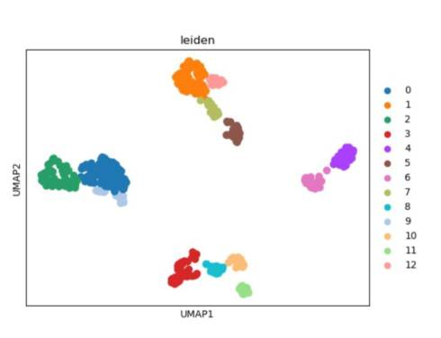

# Introduction to scDDI (Darmanis Data)
A novel dropout detection and imputation method

# Summary

A novel approach leveraging Poisson-Negative Binomial mixture models, cell-to-cell similarity calculations, and decision tree regression for accurate detection and imputation of dropout events in scRNA-seq data.


# How to use scDDI

## Data Loading and Preprocessing


Load the Libraries

```
library(SingleCellExperiment)
library('Linnorm')
```

We will give the method demonstration on Darmanis Dataset. For more details about the data, see [A survey of human brain transcriptome diversity at the single cell level](https://www.pnas.org/content/112/23/7285#:~:text=Our%20results%20show%20that%20MHCI,as%20endothelial%20cells%20and%20microglia.)

Read the gene expression data using (SingleCellExperiment object), calculate CPM values and extract metadata.


```
rawdata <- readRDS("darmanis.rds")
data <- assay(rawdata)
```
For demonstration purposes, we apply a standard *Linnorm* normalization with minimum read count =5 in 10 percent cell. However any other normalization approach may be used.
Gene should be in row, Cells should be in coloumn


```
darmanis_process= normalized_data(data)
```

```
dim(darmanis_process) 
[1] 8994    466

preprocessedata[1:2,1:3]
      Brain    Brain    Brain
A2M  0.000000 4.953487 4.908761
AAAS 1.526881 0.000000 0.000000
```

A total of 466 cells and 8994 genes are remaining in the dataset after cell, gene filtering, and Normalization.

## Calculation of dropout probability matrix and cell-to-cell similarity matrix

Load the libraries

```
library(foreach)
library(doParallel)
library(scDoc)
```

Now, calculate dropout probabilty matrix and cell-to-cell similarity matrix as follows :

```
offsets_darmanis <- as.numeric(log(colSums(darmanis_process)))
dp_darmanis <- prob.dropout(input = darmanis_process, offsets = offsets_darmanis, mcore = 6)  ## dp_darmanis is the dropout probability matrix
sim_darmanis <- sim.calc(log2(count_darmanis+1), dp_darmanis)   ## sim_darmanis is the cell-to-cell similarity matrix
```

Saving the results : the processed dataset, dropout probability matrix and cell-to-cell similarity matrix into csv file fromat. 

```
write.csv(darmanis_process,"/home/zaman/New2/darmanis_process.csv",row.names = FALSE)
write.csv(dp_darmanis,"/home/zaman/New2/dp_darmanis.csv",row.names = FALSE)
write.csv(sim_darmanis,"/home/zaman/New2/sim_darmanis.csv",row.names = FALSE)
```

Or you can also simply run the Rscript file as follows:
```
Rscript Imputation.R
```

Now, Run the following python code to impute the given dataset as follows:

```
python3 imputation_scDDI.py
```

## Clustering of the imputed dataset and calculation of Adjusted Rand Index(ARI)
    
Then, to validate the results, we utilized clustering performance metrics, specifically the Adjusted Rand Index (ARI). We compared the ARI value for both unimputed dataset and as well as imputed dataset using scDDI.

Import libraries in python and importing the data

```
import numpy as np
import pandas as pd
import scanpy as sc
adata=sc.read_csv('darmanis_imputed.csv',delimiter=',', first_column_names=None, dtype='float32')
```

Now filter with minimum 200 genes and 3 cells
```
sc.pp.filter_cells(adata, min_genes=200)
sc.pp.filter_genes(adata, min_cells=3)
sc.pp.normalize_total(adata, target_sum=1e4)
sc.pp.log1p(adata)
sc.pp.scale(adata, max_value=10)
```

Using PCA dimensionality reduction and Leiden clustering
```
sc.tl.pca(adata, svd_solver='arpack')
sc.pl.pca_variance_ratio(adata, log=True)
```


Create neighborhood graph using 20 pcs and dimension reduction using umap
```
sc.pp.neighbors(adata, n_neighbors=15, n_pcs=30)
sc.tl.umap(adata)
#Leiden clustering
#import leidenalg
#sc.tl.leiden(adata2)
##visualizing clusters
#sc.pl.umap(adata2, color=['leiden'])
```

Visualizing clusters
```
import leidenalg
sc.tl.leiden(adata)
sc.pl.umap(adata, color=['leiden'])
```



Now calculate silhouette_score
```
from sklearn.metrics import silhouette_samples, silhouette_score
sil = silhouette_score(adata.X, adata.obs['leiden'],metric='euclidean')
sil
```

Now, calculate Adjusted Rand Index
```
import pandas as pd
import numpy as np
from sklearn import metrics
l1=np.genfromtxt('darmanis_annotation.csv',dtype=None, delimiter=",")
l2=adata.obs['leiden']
ari=metrics.adjusted_rand_score(l1,l2)
ari
```    
